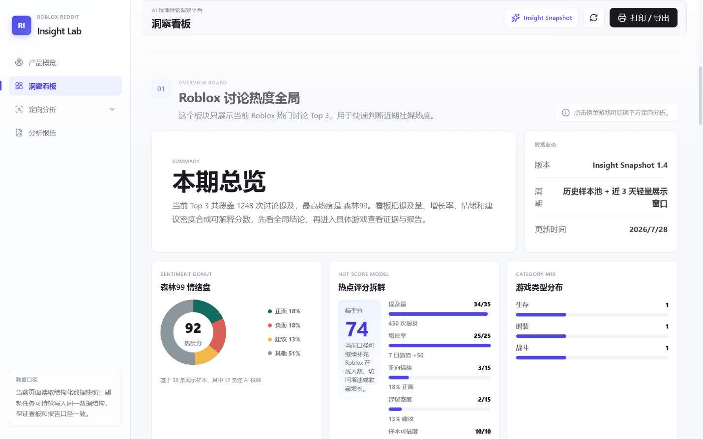
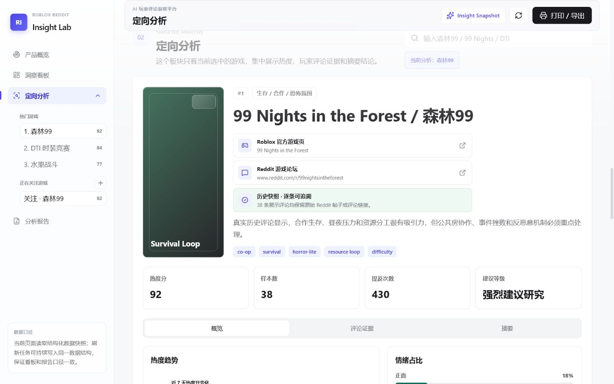
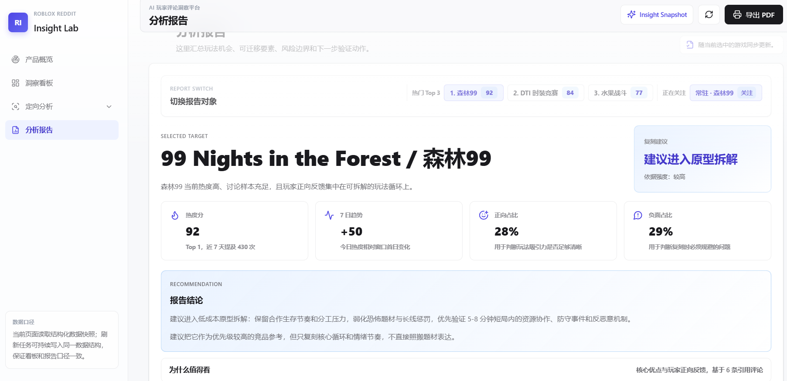

# Roblox Reddit Insight Lab

[中文](#中文说明) | [English](#english)

## 中文说明

Roblox Reddit Insight Lab 是一个轻量级市场洞察看板，用于追踪 Roblox 热门游戏讨论、整理 Reddit 玩家反馈，并将社区信号转化为可追溯的玩法研究报告。

在线访问：

```text
https://koalaa677.github.io/roblox-reddit-insight-lab/
```

### 项目截图

#### Roblox 讨论热度全局



#### 定向分析



#### 分析报告



### 核心功能

- **Roblox 讨论热度全局**：展示 Reddit 讨论热度最高的 Top 3 游戏，包含类型、趋势、评分和一句话研判。
- **可解释热点评分**：综合提及量、7 日趋势、正向情绪、建议密度和样本可信度。
- **定向游戏分析**：查看单个游戏的官方链接、Reddit 链接、趋势图、情绪占比、评论证据和摘要结论。
- **评论证据库**：保留英文原文、中文翻译、情绪标签、主题标签、来源链接和报告引用状态。
- **分析报告**：总结玩法是否值得继续研究、哪些要素可以迁移、哪些内容不应照搬，以及下一步验证动作。
- **关注游戏工作流**：支持新增关注游戏、移除二次确认，并直接跳转到对应分析。

### 产品流程

```text
Roblox 讨论热度全局
  -> Top 3 热门游戏
  -> 热点评分拆解
  -> 类型分布、情绪结构、证据流、建议分布

定向分析
  -> 当前选中游戏
  -> Roblox 与 Reddit 外部入口
  -> 近 7 天热度趋势
  -> 情绪占比
  -> 分类评论证据
  -> 摘要结论

分析报告
  -> 综合建议
  -> 可迁移玩法要素
  -> 风险与不可照搬点
  -> 验证动作
  -> 引用评论证据
```

### 热点评分模型

看板使用可解释评分，而不是只展示一个不透明的热度数字：

```text
Hot Score =
  Reddit 提及量 * 35%
+ 7 日增长 * 25%
+ 正向情绪 * 15%
+ 建议密度 * 15%
+ 样本可信度 * 10%
```

接入实时数据后，样本可信度还可以继续补充 Roblox 侧信号，例如在线人数、访问增长、收藏增长和游戏更新频率。

### 评论证据处理流程

公开版本使用结构化样本数据快照，数据结构与后续实时采集流程保持一致。生产化数据流程可以按下面方式运行：

```text
Reddit API
  -> 增量抓取评论
  -> 去重与低价值内容过滤
  -> 情绪分类：正面 / 负面 / 建议 / 其他
  -> 按时间排序
  -> 按游戏类型 -> 游戏 -> 情绪类型归档
  -> 选择代表性证据进入分析报告
```

这个设计让报告结论可以回溯到玩家原始评论，而不是只依赖不可验证的摘要。

当前仓库也提供一个低频 `public_json` fallback 脚本，用于在 Reddit OAuth 审批前验证采集链路。该入口可能返回 `403 Forbidden`，因此只适合作为原型验证；正式接入仍建议使用 Reddit OAuth Data API。

Forest99 数据已接入历史 Reddit 公开 JSON 快照：旧监控任务累计保留 10 天、147 个帖子、1579 条评论，本仓库从中抽取 14 条代表性证据进入当前报告。公开站点不会展示真实采集日期，只保留可追溯来源链接、情绪分类、标签和报告引用关系。

```powershell
node scripts/fetch-reddit-public-json.mjs --dry-run
```

### AI 分析策略

报告设计目标是在控制 token 成本的同时保留决策质量：

- 先在本地完成评论清洗、去重和分类，再把必要内容送入 AI 模型。
- 优先发送结构化指标、日摘要和高质量代表性评论，而不是发送全量原始评论。
- 要求模型输出面向决策的结构化内容：建议、迁移路径、不可照搬风险、价值和验证动作。
- 在界面中保留被引用的原评论，让结论可以被审查和追溯。

相关配置与策略文档：

```text
docs/reddit-ai-pipeline-strategy.md
data/pipeline-config.json
```

### 项目结构

```text
index.html
  -> 页面结构

styles.css
  -> 视觉系统、响应式布局、看板和报告样式

app.js
  -> 页面渲染、导航、搜索、关注游戏、评论筛选、报告切换

data/insights.json
  -> 游戏、评论、报告和外部链接的样本数据快照

data/pipeline-config.json
  -> Reddit 抓取和 AI 分析预算配置

docs/
  -> 部署、API、数据管线和参考说明
```

当前实现是一个读取结构化 JSON 快照的静态前端。这种方式让展示层保持简单，也方便后续接入定时 Reddit 采集和 AI 分析任务，而不需要改变前端数据契约。

### 本地运行

建议用本地静态服务器打开，确保浏览器可以读取 `data/insights.json`。

```powershell
cd C:\Users\gaoyucheng01\Desktop\新建文件夹\roblox-reddit-insight-lab
python -m http.server 4173 --bind 127.0.0.1
```

打开：

```text
http://127.0.0.1:4173
```

### 部署

项目可以作为静态站点部署。仓库已包含：

- `.nojekyll`：用于 GitHub Pages 静态文件处理。
- `.github/workflows/deploy-pages.yml`：用于 GitHub Pages 自动部署。
- `vercel.json`：用于 Vercel 静态托管。

部署说明：

```text
docs/deployment-guide.md
```

### 数据与 API 说明

- 抓取 Reddit 评论不消耗 AI token，只消耗 Reddit API 请求额度。
- 只有当文本或结构化证据被发送给模型分析时，才会产生 AI token 成本。
- API 凭证不应暴露在前端代码中。
- 实际接入时，建议由本地脚本、定时任务或后端任务生成与前端一致的 JSON 数据结构。

### 路线图

- 接入 Reddit API，支持指定 subreddit 和游戏关键词采集。
- 增加自动评论清洗、去重和四分类。
- 基于精选证据生成日摘要和周分析报告。
- 增加数据新鲜度指标，例如抓取量、过滤量和引用证据数。
- 扩展 Roblox 侧信号，例如在线人数、访问量、收藏量和更新频率。

### 暂不做

- Discord 数据采集。
- 在浏览器中暴露 Reddit 或 AI token。

---

## English

Roblox Reddit Insight Lab is a lightweight market intelligence dashboard for tracking Roblox game discussions, organizing Reddit player feedback, and turning community signals into gameplay research reports.

Online site:

```text
https://koalaa677.github.io/roblox-reddit-insight-lab/
```

### Screenshots

#### Roblox Discussion Overview


#### Targeted Game Analysis


#### Analysis Report


### Features

- **Roblox discussion overview**: shows the current Top 3 games by Reddit discussion heat, with genre, trend, score, and a short research judgment.
- **Explainable hot score**: combines mentions, 7-day trend, positive sentiment, suggestion density, and sample confidence.
- **Targeted game analysis**: drills into one selected game with official links, Reddit links, trend charts, sentiment split, comments, and summary.
- **Comment evidence library**: keeps original English comments, Chinese translations, sentiment labels, tags, source links, and report citation state.
- **Analysis report**: summarizes whether a gameplay loop is worth further research, what can be adapted, what should not be copied, and what validation actions should follow.
- **Watchlist workflow**: supports adding tracked games, removing them with confirmation, and jumping directly into the related analysis.

### Product Flow

```text
Roblox discussion overview
  -> Top 3 trending games
  -> hot score breakdown
  -> genre mix, sentiment, evidence flow, recommendation mix

Targeted analysis
  -> selected game profile
  -> Roblox and Reddit source links
  -> 7-day heat trend
  -> sentiment split
  -> categorized comment evidence
  -> concise AI summary

Analysis report
  -> overall recommendation
  -> transferable gameplay elements
  -> risks and non-transferable parts
  -> validation actions
  -> cited comment evidence
```

### Scoring Model

The dashboard uses an explainable score instead of a single opaque popularity number:

```text
Hot Score =
  Reddit mentions * 35%
+ 7-day growth * 25%
+ positive sentiment * 15%
+ suggestion density * 15%
+ sample confidence * 10%
```

When connected to live data, the sample confidence layer can be expanded with Roblox-side signals such as concurrent users, visit growth, favorite growth, and game update frequency.

### Comment Evidence Pipeline

The public version uses a curated sample dataset with the same structure expected from the live pipeline. A production data pipeline can follow this flow:

```text
Reddit API
  -> incremental comment collection
  -> deduplication and low-value content filtering
  -> sentiment classification: positive / negative / suggestion / other
  -> time-based sorting
  -> archive by game genre -> game -> sentiment type
  -> select representative evidence for the analysis report
```

This keeps report conclusions traceable back to player comments instead of relying on unsupported summaries.

The repository also includes a low-volume `public_json` fallback script for validating the collection workflow before Reddit OAuth approval. This endpoint may return `403 Forbidden`, so it should be treated as a prototype fallback only; the recommended production path remains Reddit OAuth Data API.

Forest99 now uses a historical Reddit public JSON snapshot: an earlier monitor retained 10 days of data, including 147 posts and 1,579 comments. This repository imports 14 representative evidence items into the current report while hiding exact collection dates in the public interface and preserving traceable source links, sentiment classes, tags, and report-citation status.

```powershell
node scripts/fetch-reddit-public-json.mjs --dry-run
```

### AI Analysis Strategy

The report is designed to minimize token usage while preserving decision quality:

- Clean, deduplicate, and classify comments locally before sending anything to an AI model.
- Send structured metrics, daily summaries, and selected high-quality evidence instead of the full raw comment set.
- Ask the model for decision-ready outputs: recommendation, adaptation path, non-transferable risks, value, and validation actions.
- Keep the original cited comments visible in the UI so conclusions remain auditable.

Related configuration and strategy notes:

```text
docs/reddit-ai-pipeline-strategy.md
data/pipeline-config.json
```

### Architecture

```text
index.html
  -> page structure

styles.css
  -> visual system, responsive layout, dashboard and report styles

app.js
  -> rendering, navigation, search, watchlist, comment filters, report switching

data/insights.json
  -> sample insight dataset with games, comments, reports, and source links

data/pipeline-config.json
  -> Reddit collection and AI analysis budget configuration

docs/
  -> deployment, API, pipeline, and reference notes
```

The current implementation is a static frontend that reads a structured JSON snapshot. This keeps the display layer simple and makes it easy to connect a scheduled Reddit and AI analysis job later without changing the page contract.

### Local Development

Use a local static server so the browser can load `data/insights.json`.

```powershell
cd C:\Users\gaoyucheng01\Desktop\新建文件夹\roblox-reddit-insight-lab
python -m http.server 4173 --bind 127.0.0.1
```

Open:

```text
http://127.0.0.1:4173
```

### Deployment

The project can be deployed as a static site. The repository includes:

- `.nojekyll` for GitHub Pages static file handling.
- `.github/workflows/deploy-pages.yml` for GitHub Pages deployment.
- `vercel.json` for Vercel static hosting.

Deployment guide:

```text
docs/deployment-guide.md
```

### Data And API Notes

- Reddit collection does not consume AI tokens; it consumes Reddit API request quota.
- AI token usage starts only when text or structured evidence is sent to a model.
- API credentials should never be exposed in frontend code.
- A practical live pipeline should run from a local script, scheduled job, or backend task that writes the same JSON schema consumed by the frontend.

### Roadmap

- Connect Reddit API collection for selected subreddits and game keywords.
- Add automated comment cleaning, deduplication, and four-way classification.
- Generate daily summaries and weekly analysis reports from selected evidence.
- Add data freshness indicators for collection volume, filtered volume, and cited evidence count.
- Expand Roblox-side signals for online users, visits, favorites, and update cadence.

### Out Of Scope

- Discord collection.
- Exposing Reddit or AI tokens in the browser.
